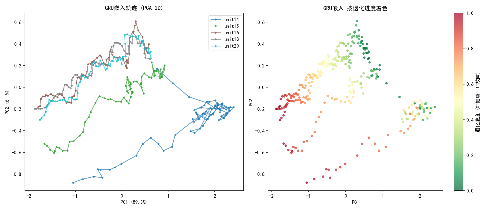
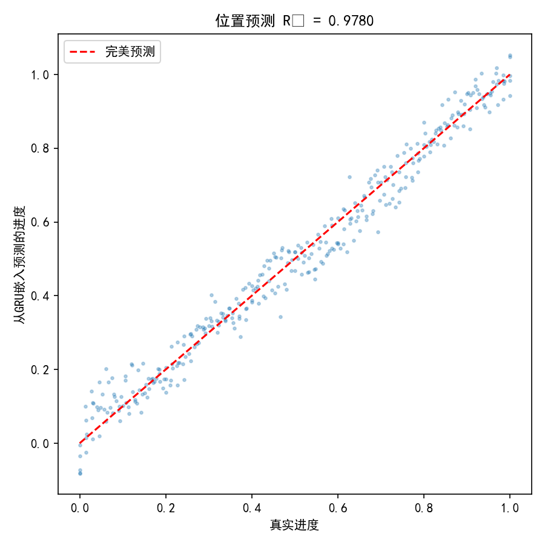
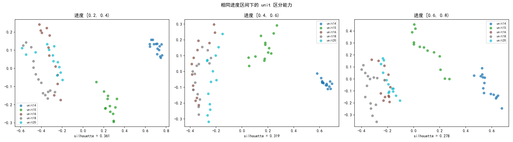
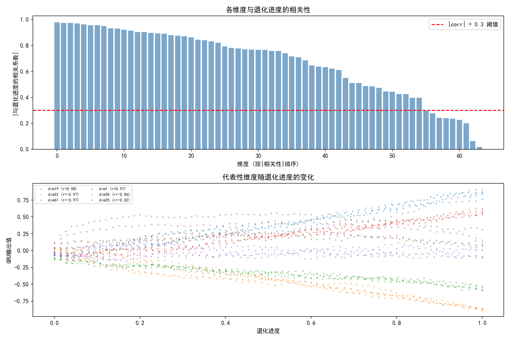
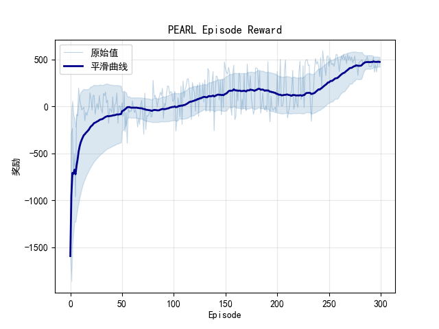
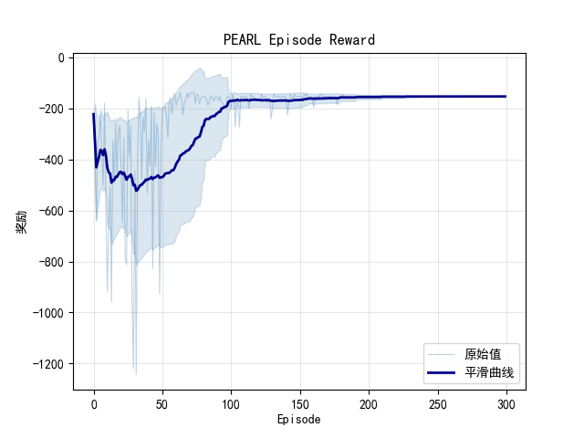

# PEARL 预测性维护项目现状

## 1. 数据处理

### 1.1 数据来源

使用 N-CMAPSS（DS02）涡扇发动机退化数据集，包含 5 台发动机（unit 14/15/16/18/20），每台有一条从健康到故障的完整退化序列。训练集使用 unit 16/18/20，测试集使用 unit 14/15。

### 1.2 处理流程

数据处理由 `step4_unified.py` 统一完成，替代了之前分散的 step4.1 + step4.2：

1. **特征提取**：从原始传感器数据提取时域 + 频域特征
2. **全局相关性去重**：合并 5 个 unit 数据，删除相关系数 >0.95 的冗余特征
3. **统一 MI 特征选择**：对每个 unit 独立计算 Mutual Information（目标变量 = HPT_eff_mod、LPT_flow_mod、LPT_eff_mod），取平均后选 top-32 个传感器特征 + 11 个必选特征（运行工况 + 健康指标）= **43 维**
4. **全局标准化**：合并所有 unit 数据计算全局 mean/std，确保跨 unit 尺度一致
5. **缺失值处理**：前向填充 + 局部中位数兜底，记录 mask / delta / outlier 标志
6. **输出**：每个 unit 一个 `trajectory_complete.npy`，shape = (seq_len, 43)

### 1.3 数据质量验证

数据质量通过 GRU 编码器诊断（`experiments/diagnose_gru.py`）间接验证——如果数据质量差（噪声大、缺失多、标准化错误），GRU 无法学到有意义的表征。四项检查全部通过，说明输入给 RL 的 43 维特征序列质量良好。

## 2. GRU 诊断四张图怎么看

### 2.1 Check 1：退化轨迹 PCA



**左图**（按 unit 着色）：5 台发动机的 GRU 嵌入轨迹在 PCA 空间中各自形成独立路径，没有完全重叠。说明 GRU 编码了**设备个体差异**——不同发动机即使退化进度相同，嵌入也不一样。PC1 解释了 89.2% 的方差，是主导维度。

**右图**（按退化进度着色）：颜色从绿（健康）到红（故障）平滑过渡，没有颜色跳跃或混乱。说明 GRU 嵌入**单调跟踪退化进度**，嵌入空间有清晰的退化方向。

**结论**：GRU 同时编码了退化进度和设备个体信息，对 PEARL 的 context encoder 有价值。

### 2.2 Check 2：位置预测 R²



用线性回归从 64 维 GRU 嵌入预测归一化退化进度（0=健康，1=故障），**R² = 0.978**。

**怎么看**：R² 越接近 1，嵌入与退化进度越线性相关。0.978 极高，说明 GRU 的 64 维输出几乎可以被一个线性函数映射到退化进度。散点紧贴 y=x 对角线，只有在进度 0.2~0.4 区间有少量散布。

**注意**：R²=0.978 也意味着 GRU 输出和 pos_A/pos_B 高度冗余。但结合 Check 3 的 silhouette >0.3，说明 GRU 在位置之外还编码了 unit 差异。

### 2.3 Check 3：Unit 区分能力



在相同退化进度区间内（控制进度变量），看 GRU 嵌入能否区分不同 unit。三个进度区间的 silhouette 分数：

| 进度区间 | Silhouette | 判定 |
|---------|-----------|------|
| [0.2, 0.4) | 0.349 | 好 |
| [0.4, 0.6) | 0.360 | 好 |
| [0.6, 0.8) | 0.319 | 好 |

**怎么看**：Silhouette > 0.3 表示同 unit 样本聚类紧凑、不同 unit 有明显间隔。图中可以看到 unit 14（蓝色）和 unit 20（青色）在各进度区间都与其他 unit 分开。

**结论**：在退化进度相同的前提下，GRU 仍能区分不同发动机，说明编码了超越位置信息的设备特征。这正是 PEARL 元学习需要的——context encoder 需要从观测中推断"这是哪种类型的设备"。

### 2.4 Check 4：维度信噪比



**上图**：64 维按与退化进度的|相关系数|排序。红线 = 0.3 阈值。大约 40 维超过 0.3，20+ 维超过 0.6，说明 GRU 输出不是噪声——大多数维度都携带退化信号。

**下图**：代表性维度随退化进度的变化趋势。高相关维度（如 dim17, r=0.89）随进度单调变化，各 unit 趋势一致但数值不同（体现个体差异）；低相关维度近乎平坦/无规律。

**结论**：64 维中约 60% 以上有意义，GRU 编码器质量合格。

### 2.5 综合判断

| 检查项 | 结果 | 含义 |
|--------|------|------|
| PCA 轨迹 | 各 unit 分离，颜色平滑 | 编码了个体差异 + 退化进度 |
| 位置 R² | 0.978 | 与退化进度高度线性相关 |
| Unit 区分 | silhouette 0.32~0.36 | 在进度相同时仍能区分 unit |
| 有效维度 | ~40/64 维 |corr|>0.3 | 大多数维度携带信号 |

**数据→GRU→RL 这条链路的前半段（数据质量 + GRU 编码质量）已验证通过。**

## 3. 环境设计

### 3.1 当前设计

双部件（HPT 效率 + LPT 流量）自动运行维护环境。每步设备自动退化（pointer_A 和 pointer_B 各 +1），agent 只决定是否维修。

- **State**：`[GRU_emb(64), pos_A(1), pos_B(1)]` = 66 维
- **5 个离散动作**：0=不干预, 1=修A, 2=修B, 3=修AB, 4=更换
- **Episode 终止**：任一 pointer 到达 seq_len（故障, -200 penalty）/ 连续维修 ≥10 次（over_repair, -100 penalty）/ 存活 200 步（+50 bonus）

### 3.2 Reward 结构

每步 reward = 运营收益(+3.0) - 维修成本 + reward shaping + 终止奖惩

| 组件 | 公式 | 说明 |
|------|------|------|
| 运营收益 | +3.0/步（无条件） | 设备自动运行的收入 |
| 维修成本 | C_prev × (1 + 0.3 × count) | 单部件 3.0 基础，随维修次数递增 |
| AB 维修 | C_prev_AB × (1 + 0.3 × max_count) | 双部件 5.0 基础 |
| 更换 | -40.0（固定） | 最贵，但 pointer 归零 |
| Reward shaping | γΦ(s') - Φ(s), Φ=-15(pA+pB)/L | Potential-based，不改变最优策略 |
| 故障 penalty | -200.0 | pointer 到达 seq_len |
| Over-repair penalty | -100.0 | 连续维修 ≥10 次 |
| 存活 bonus | +50.0 | 200 步不故障 |

### 3.3 理论最优策略

| 策略 | 总 reward | 说明 |
|------|----------|------|
| 纯跑不修 | ~+25 | 跑到故障吃 -200 |
| **2-3 次战略维修 + 存活** | **~+600** | 最优 |
| 连续修 ×10 | ~-190 | 过度维修自惩罚 |
| 纯更换 ×10 | ~-470 | 最差 |

阈值专家策略实测可达 **+633**，证明最优策略可达。

### 3.4 解决了哪些设计问题

| 问题 | 旧设计 | 修复 |
|------|--------|------|
| Agent 可以永远不运行设备 | 8 动作含"run" | 改为自动运行，agent 只管维修 |
| 单 pointer 管两个部件 | pointer=max(pA,pB) | 双独立 pointer |
| 维修可能推高 pointer | pointer=restore_point(count) | pointer=min(pointer, restore_point) |
| Over-repair penalty 太低 | -50 < 故障 -200 | 提高到 -100 |
| Replace 绕过 over_repair 计数 | replace 重置 count | replace 也计入 |
| 运营收益在高退化时变负 | step_reward 依赖退化 | R_run=3.0 恒正 |

## 4. 训练效果

### 4.1 算法架构

PEARL（Probabilistic Embeddings for Actor-critic RL）+ Discrete SAC：

- **Context Encoder**：从 episode 内的 (s, a, r, s') 序列推断任务表示 z（8 维）
- **Actor**：输入 (state, z)，输出 5 个动作的概率分布（softmax）
- **Critic**：输入 (state, z)，输出 5 个动作的 Q 值
- **Actor Loss**：Discrete SAC — `(π * (α·logπ - Q_all)).sum()`，评估全部动作 Q 值
- **Auto-alpha**：可学习温度参数，target_entropy = 0.1·ln(5) ≈ 0.161
- **Demo 注入**：30 条阈值专家正样本（+600）+ 15 条纯 run 负样本（+25 撞故障）预填 replay buffer

### 4.2 收敛证据

以最新两个 seed（seed 0, seed 2，各 300 episode）为依据：

**指标 1：训练 reward 曲线**

| Seed | 最后 50 集均值 | 最后 50 集最低 | 最后 50 集最高 |
|------|---------------|---------------|---------------|
| 0 | ~475 | +330 | +557 |
| 2 | ~350 | -178 | +584 |

Seed 0 的平滑曲线从 ep 50 的 -500 持续上升到 ep 250+ 稳定在 +400~+550 区间。Seed 2 也上升到正区间但振荡更大。




**指标 2：Q 值量级**

| Seed | Q(run) | Q(修A) | Q(修B) | Q(修AB) | Q(更换) |
|------|--------|--------|--------|---------|---------|
| 0 ep300 | +132.2 | +124.8 | +125.7 | +107.2 | +98.3 |
| 2 ep300 | +137.0 | +125.2 | +121.7 | +110.5 | +90.5 |

Q 值全为正且在 +90~+140 量级，与理论最优 reward（+600）经过折扣后的量级一致。对比调试初期 Q 值全为负（-120 ~ -190），说明 critic 已正确估计动作价值。

**指标 3：Alpha 和 Entropy**

| Seed | Alpha 轨迹 | 最终 Entropy |
|------|-----------|-------------|
| 0 | 2.0 → 7.2(ep59) → 1.7(ep300) | 0.31 |
| 2 | 2.0 → 8.3(ep59) → 1.7(ep300) | 0.22 |

Alpha 先升后降、最终稳定在 1.7 附近，entropy 维持 0.2~0.5。对比之前：alpha 要么卡在 0.27 不动（策略锁死），要么爆到 7.0（策略崩溃）。现在 auto-alpha 正常工作。

**指标 4：动作分布**

```
Seed 0 ep300: Counter({0:188, 1:7, 4:3, 2:2})  → 94% run + 5% repair
Seed 2 ep300: Counter({0:185, 1:11, 4:2, 2:2})  → 93% run + 7% repair
```

符合最优策略结构：大部分时间不干预，在退化关键阈值处执行少量维修。

**指标 5：Loss 收敛**

| Seed | loss_critic ep300 | loss_actor ep300 |
|------|------------------|-----------------|
| 0 | 10.0（从 33.6 降） | -145.6 |
| 2 | 12.0（从 34.0 降） | -146.0 |

Critic loss 从 30+ 持续下降到 10~12，说明 Q 值估计误差在缩小。Actor loss 为负且绝对值增大，是 Discrete SAC 的正常行为（最大化 Q 值期望 - entropy 惩罚）。

### 4.3 残留问题

- Seed 2 振荡较大，偶尔掉到负值
- 300 episode 可能不够，reward 曲线未完全 plateau
- 维修时机偏晚（pointer ~0.85L 才修，理论最优 ~0.5L）

## 5. 测试泛化

### 5.1 当前结果

| Unit | Seed 0 | Seed 2 |
|------|--------|--------|
| 15 | **+645**（87% episode >600） | **+545**（100% >500） |
| 14 | +6.6（纯 run，0 次维修） | **+576**（83% >500） |

Unit 15 上两个 seed 都泛化成功，reward 接近理论最优 +600。Unit 14 在 seed 2 泛化成功但 seed 0 完全失败。

### 5.2 问题分析

Seed 0 在 unit 14 上的失败不是 unit 14 不可解（seed 2 证明可解），而是 context encoder 对 unit 14 生成的 z 向量质量不稳定——不同 seed 训练出的 encoder 对同一 unit 映射不同。

训练仅用了 3 个 unit（16/18/20），context encoder 见过的 z 分布太窄，泛化能力有限。这是当前的核心瓶颈。
